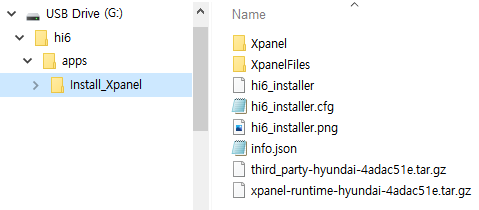

# 2.1 Preparation

The Hi6 app installation file consists of several files, as shown in the example below.
Let me take Cimon Xpanel, the Teach Pendant app, as an example.
Copy the installation folder of the Hi6 app to the path below in USB memory.

/hi6/apps/

