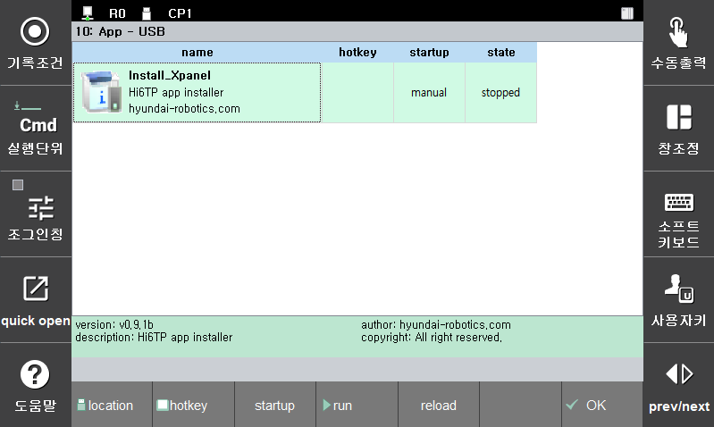
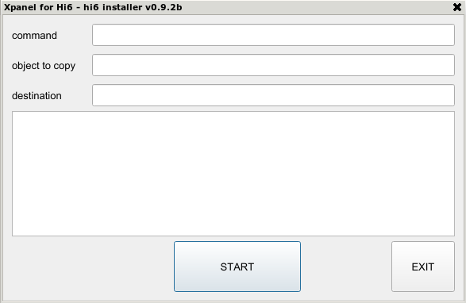
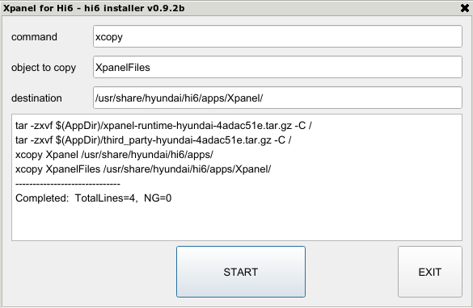
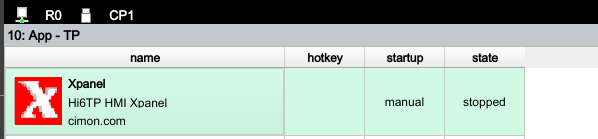

# 2.2 Install

1) Install the prepared USB memory into the Teach Pendant.

2) Select the `Service - 10:App` menu.

3) Click the `[F1:Location]` button until the title bar becomes `App - USB`.

 

4) Click the `[F4:run]` button to run the hi6 installer.

 

5) Click the `[START]` button to proceed with the installation. If it says Completed at the bottom of the log, the installation has completed successfully.

 

6) Click the `[EXIT]` button to exit.

7) Click the `[F1:Location]` button until the title bar becomes `App - TP`, you can see the new Xpanel item.

 
