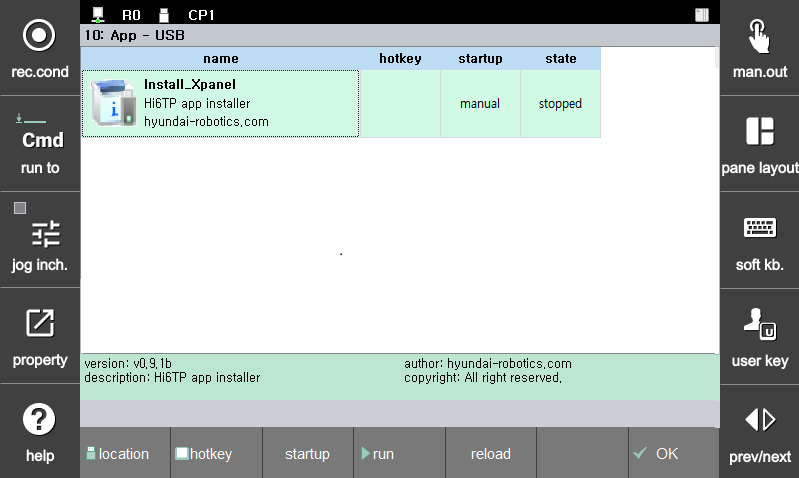
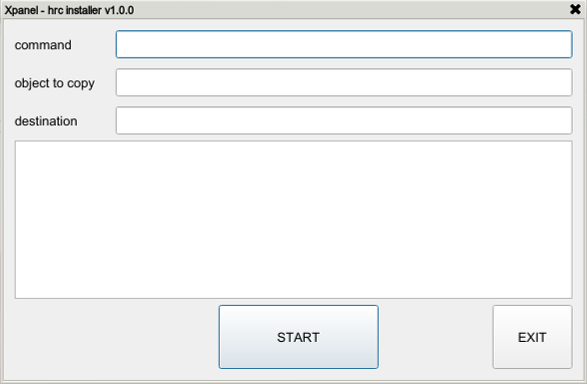
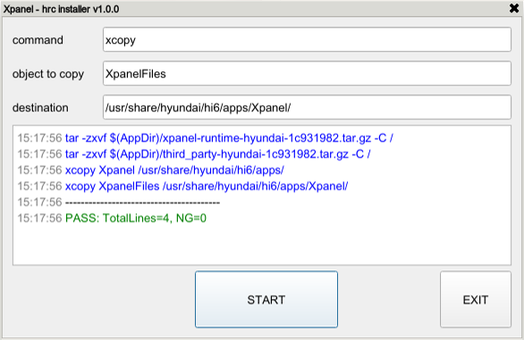
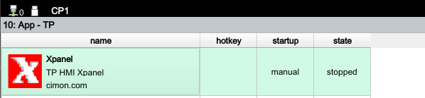

# 2.2 安装

1) 将准备好的 USB 存储器插入教导 pendant。

2) 选择 `服务 - 10:应用 (Service - 10:App)` 菜单。

3) 单击 `[F1:Location]` 按钮，直到标题栏变为 `应用 - USB (App - USB)`。

 

4) 单击 `[F4:运行] ([F4:run])` 按钮以运行 ${cont_model} 安装程序。

 

5) 单击 `[START]` 按钮以继续安装。如果日志底部显示“已完成”，则说明安装已成功完成。

 

6) 单击 `[EXIT]` 按钮以退出。

7) 单击 `[F1:Location]` 按钮，直到标题栏变为 `应用 - TP (App - TP)`，您可以看到新的 Xpanel 项目。

 