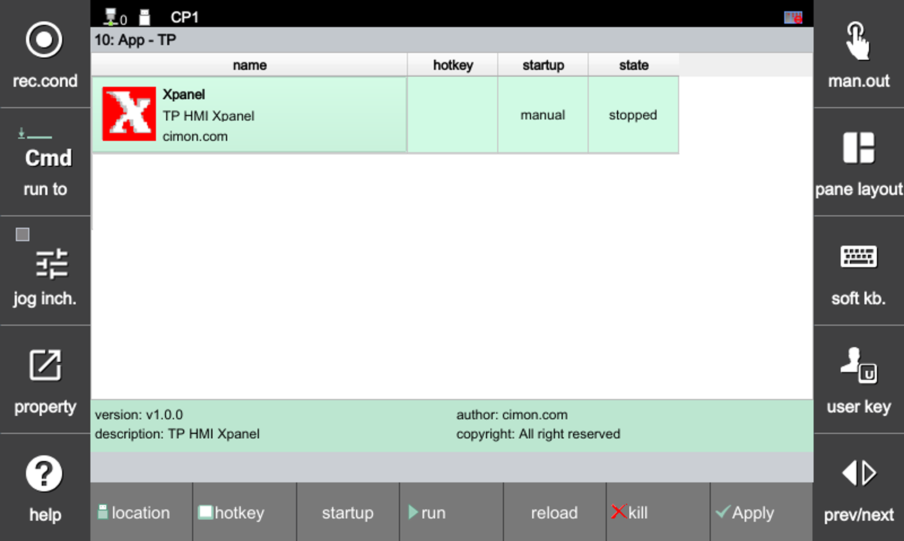
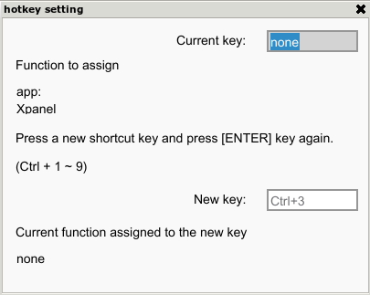

# 3.1 热键和执行方式

如果您将热键分配给常用的应用程序，这很方便，因为只需在任何屏幕上按下键即可执行。  
选择应用程序并单击 `[F2:快捷键] ([F2:hotkey])` 按钮。

 

在热键设置对话框中，通过按下所需的 `Ctrl+1` 到 `Ctrl+9` 完成设置，然后按 `[ENTER]` 键。

 

如果您通过单击 `[F3:启动] ([F3:startup])` 切换按钮将启动列更改为开机启动，则当 ${cont_model} 控制器启动时，该应用程序将自动运行。

如果您再次单击 `[F3:启动] ([F3:startup])` 按钮，则启动列将变为手动，自动运行将被禁用。