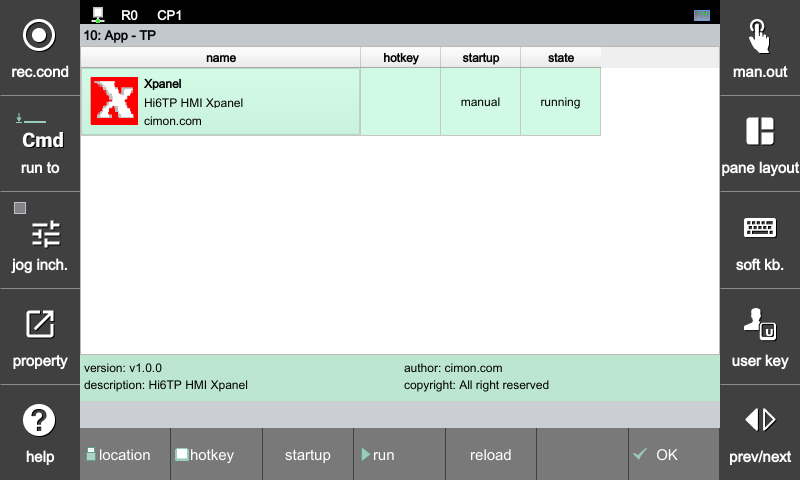

# 2.3 단축키(hotkey)와 실행방식

자주 사용하는 앱에는 단축키를 할당하면, 어떤 화면에서든 키조작만으로 실행할 수 있어 편리합니다.
앱을 선택한 후, \[F2:hotkey\] 버튼을 클릭합니다.

 

hotkey setting 대화상자에서 원하는 Ctrl+1 ~ Ctrl+9 중 원하는 단축키를 누른 후 \[ENTER\] 키로 설정을 완료하십시오.

 

\[F3:startup\] 버튼을 클릭하여 startup 열을 boot로 변경하면, Hi6 제어기가 부팅할 때 앱이 자동으로 실행합니다.

다시 한번 \[F3:startup\] 버튼을 클릭하면 startup 열이 manual로 변경되면서 자동실행이 해제됩니다.
