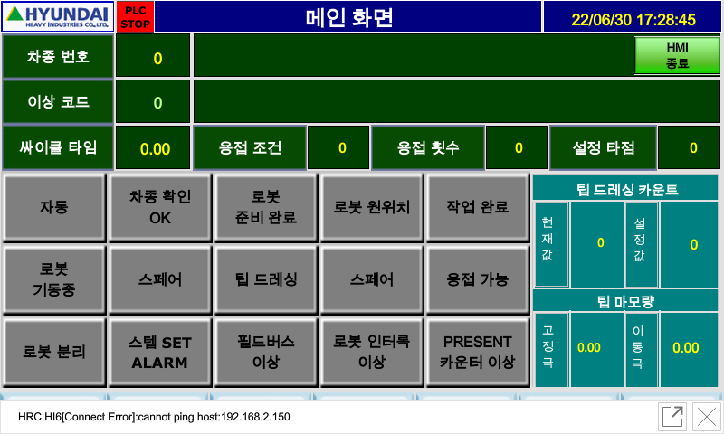
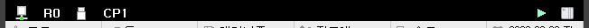
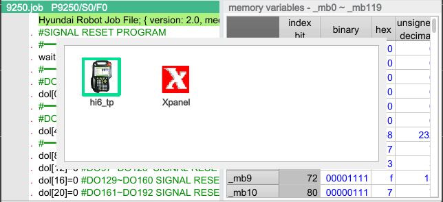

# 3.2. execution and switching

After selecting the app, click the `[F4:run]` button to launch the app.

 

Press and hold the `[SHIFT+R..]` key for about a second to switch to the TeachPendant main screen without shutting down the app.

On this screen, you see the  icon on the right side of the top title bar, which means there is more than one app running in the background.

 

Once again, pressing the `[SHIFT+R..]` key will display the app switch dialog box, select the icon with the left/right arrow and press the `[ENTER]` key to bring the app to the front.

 

To exit an app, use the exit feature of that app, for example, Xpanel has a exit button in the upper right corner of the `Diagnostics` screen.

 
