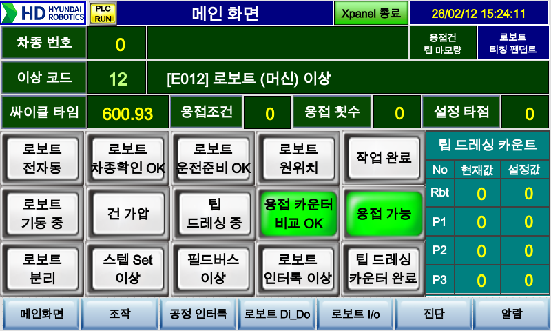
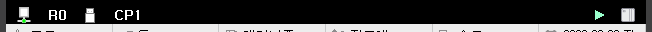
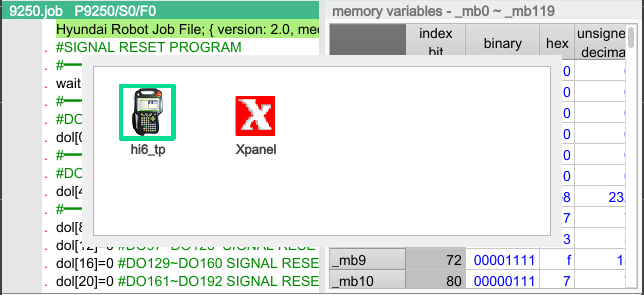

# 3.2. 执行和切换

选择应用后，点击`[F4:运行] ([F4:run])`按钮以启动应用。

 

按住`[SHIFT+R..]`键约一秒钟，以在不关闭应用的情况下切换到TeachPendant主屏幕。

在此屏幕上，您会看到顶部标题栏右侧的图标，这意味着后台有多个应用在运行。

 

再次按`[SHIFT+R..]`键将显示应用切换对话框，选择具有左右箭头的图标并按`[ENTER]`键将应用置于前面。

 

要退出应用，请使用该应用的退出功能，例如，Xpanel在`主 (Main)`或`Diagnostics`屏幕的右上角有一个退出按钮。

 